<!--
Week 1 Session A. Mini-lecture budget: 25 minutes.
Source: 01_Introduction to Artificial Intelligence.pptx (19 slides), reordered
into a single chronological timeline. Lesson plan: ../../weeks/week-01.md
-->

# Artificial Intelligence

## Classical Foundations, Modern Comparisons

**CMP-4004** · Week 1

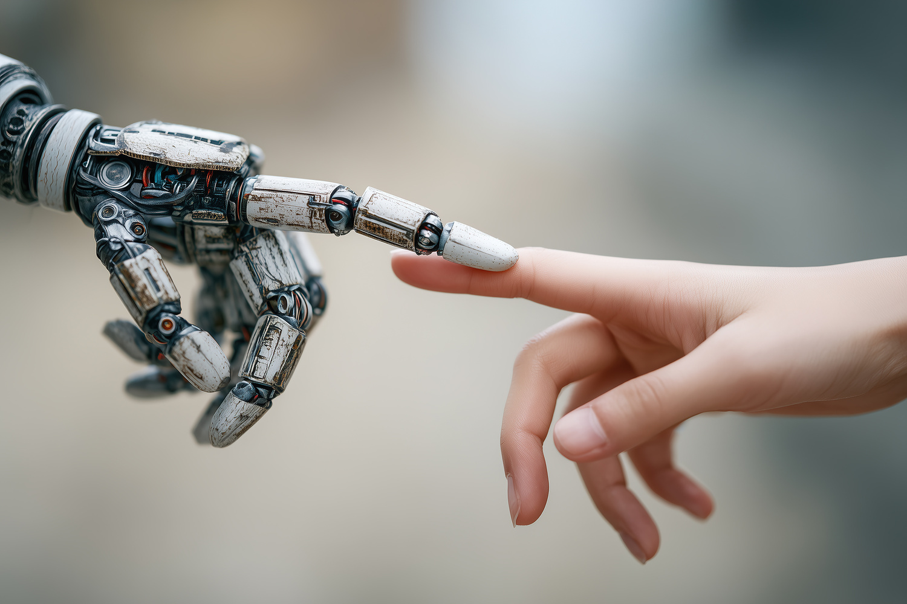

---

# What do we mean by *intelligence*?

- The ability to understand or comprehend
- The ability to solve problems
- Knowledge, comprehension, the act of understanding
- The meaning assigned to a proposition or expression
- Ability, skill, and experience

## And by *artificial* intelligence?

<!--
2 min. Do NOT resolve this. The warm-up poll has already been taken and the
results are on screen. Point out that all five definitions are circular or
contested — every one of them uses a word that needs the same explaining.
This is exactly the problem Turing faced, which sets up the paper discussion.
-->

---

# The oldest ideas are older than you think

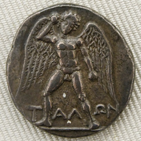

**~800 BC** — the *Iliad* describes **Talos**: a bronze automaton guarding Crete
from pirates and invaders.

The idea of a made thing that acts on its own is not a computing idea. It is a
mythological one, and it arrives ~2,700 years before the hardware.

---

# ~200 BC — The Antikythera Mechanism

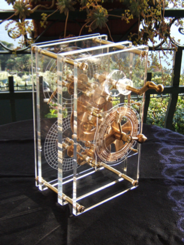

The earliest known **analog computer**. Predicts astronomical positions and
eclipses up to 19 years ahead; also computes the dates of six Greek athletic
competitions.

> This discovery fundamentally challenges the belief that human technological
> development has always been incremental.

<!--
1 min. The recovery story is worth 20 seconds: divers found it in 1900;
archaeologists dismissed a gear embedded in rock in 1902 because the mechanism
"seemed too advanced for the period." Serious study only resumed 1951-1971.
The lesson is about how experts handle evidence that contradicts their model —
which is a lesson this course will use repeatedly.
-->

---

# 1770 — The Mechanical Turk

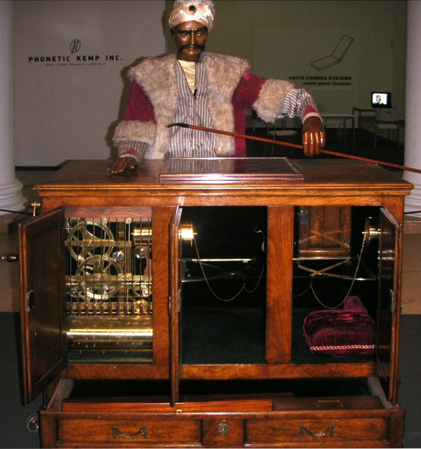

Built by Wolfgang von Kempelen. Appeared to play chess at a high level against
human opponents.

**There was a human hidden inside.**

### Question for the room

What is the modern equivalent?

<!--
2 min, and take the detour. Someone will say data labelers, RLHF annotators, or
"AI" products with humans in the loop. That is the right answer. Amazon named a
crowdwork platform after this machine, apparently on purpose.
The Turk is the first AI fraud and it establishes the course's core distinction:
the APPEARANCE of intelligence versus the mechanism.
Also on this slide's era: the Jaquet-Droz automata (1768-1774) — the musician,
the draughtsman, and the writer. Real mechanisms, no hidden human.
-->

---

# 1936–1945 — General-purpose computation

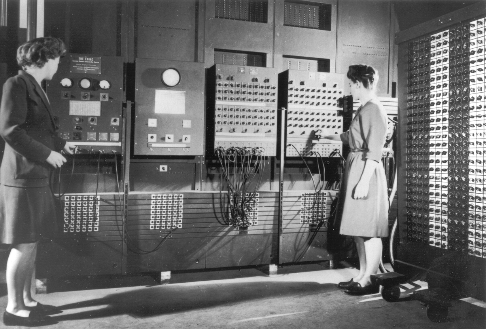

**Z1** (1936, Konrad Zuse) — binary calculator, read operations from punched
cards, floating-point arithmetic, storage memory.

**ENIAC** (1945) — Electronic Numerical Integrator and Computer. Programmable,
vacuum tubes, 170 m², 27 metric tons.

Now the substrate exists. Everything after this is about **what to compute**.

---

# 1950 — The Turing Test

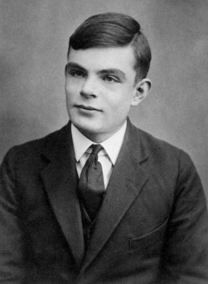

Two humans and one computer. The interrogator is isolated and asks questions
through a text terminal, then decides which respondent is the machine.

If the interrogator cannot tell, **the machine is assumed intelligent**.

> An attempt to provide an *operational* and satisfactory definition of
> intelligence.

<!--
2 min. The word doing the work is "operational." Turing's move: replace an
unanswerable question ("can machines think?") with a decidable one ("can they
pass this test?"). That is the founding methodological move of the field, and it
is the same move behind every benchmark students will run this semester.
Connect forward: the paper discussion already covered §6's nine objections.
Connect to the course: the benchmark turned out to be gameable. Hold that thought.
-->

---

# 1956 — Dartmouth: the field gets a name

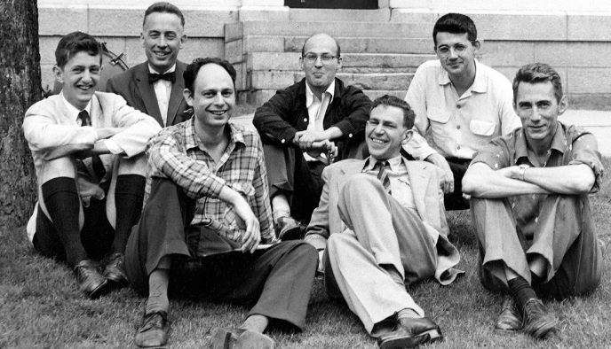

> "The study is to proceed on the basis of the conjecture that **every aspect of
> learning or any other feature of intelligence can in principle be so precisely
> described that a machine can be made to simulate it.**"

McCarthy · Minsky · Rochester · Shannon

**The 1956 agenda:** automatic computers · programming a computer to use language ·
neuron nets · theory of the size of a calculation · self-improvement ·
abstractions · randomness and creativity

<!--
2 min. Read the last sentence of the proposal out loud: "We think that a
significant advance can be made... if a carefully selected group of scientists
work on it together for a summer."
Then ask how that estimate held up. The seven agenda items are still open
research areas 70 years later. This is the field's founding document and its
first schedule slip, and optimism about timelines is a permanent feature of AI.
-->

---

# 1957–1958 — Two languages, two philosophies

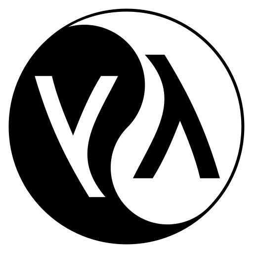

| **FORTRAN** (1957, IBM) | **LISP** (1958, McCarthy) |
|---|---|
| Numerical computation | Symbolic computation |
| **Imperative** | Based on **λ-calculus** and recursion |
| Manages state (variables) | Dynamic types and functions |
| Conditionals, loops | Main structure: the **list** |
| | Prefix calls: `(f a1 a2 a3)` |

Symbolic AI was written in LISP for thirty years because the language and the
theory shared a shape.

---

# 1958 — The Perceptron

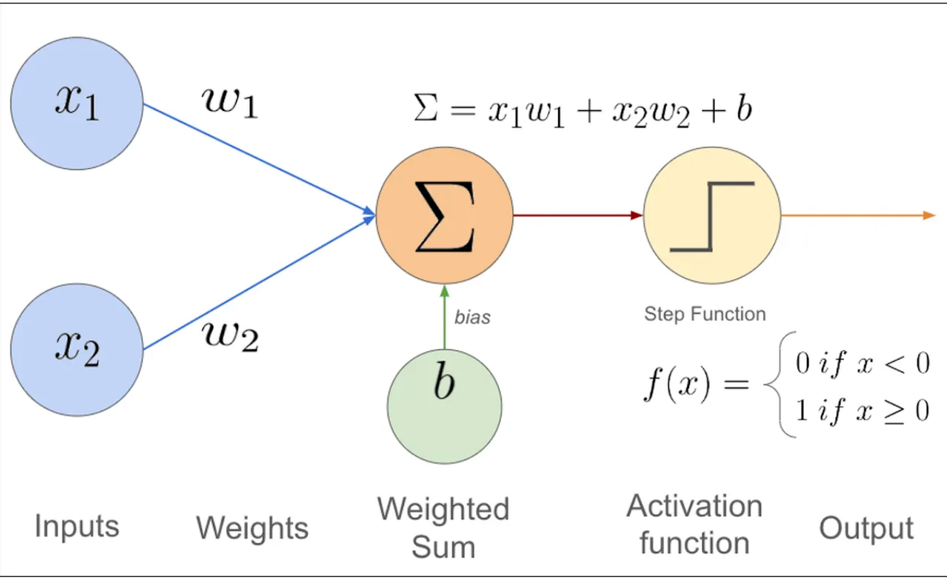

A computational model inspired by biological neurons, proposed by
**Frank Rosenblatt**.

- A network of simple processing units that stores knowledge from experience
- Knowledge is acquired from the environment through a **learning process**
- Connections between units — **synaptic weights** — are where knowledge lives

**The idea:** learn from data instead of being programmed.

<!--
1 min here; the full treatment is week 14.
CORRECTION TO STATE OUT LOUD: deck 07 of the original material calls him "Mark"
Rosenblatt. It is FRANK Rosenblatt. The "Mark I Perceptron" was the machine —
that is almost certainly where the error came from. Correct it openly; modeling
how to handle an error in a source is part of what this slide teaches.
-->

---

# 1972 — Prolog

**Algorithm = Logic + Control**

- A **declarative** logic-programming language
- Programs are sets of clauses in a notation close to first-order logic
- The programmer states what is *true*; the language does the searching
- Many expert systems — legal, medical, financial — were written in it

<!--
1 min. Full treatment in week 8.
TWO CORRECTIONS to the original deck, and make them visibly:
  1. It says "Created by Dennis Ritchie at Bell Labs." That is false. Prolog was
     created by ALAIN COLMERAUER and PHILIPPE ROUSSEL in Marseille in 1972.
     Ritchie created C — a reasonable thing to confuse only if you are not
     looking closely.
  2. It calls Prolog "an imperative, compiled language" two lines after
     correctly describing logic programming. Prolog is declarative.
Say plainly: I am correcting my own course material in front of you. Do this to
my slides too when you find something wrong. That instruction is load-bearing
for a course whose whole method is checking claims against evidence.
-->

---

# What *is* a model?

- A description of a system or phenomenon in mathematical language
- A **hypothesis** for explaining a phenomenon
- Something we construct or assume, based on rules defined *a priori* or on
  observations

## Two ways to build one

| **Formal methods** | **Statistical methods** |
|---|---|
| First-order logic | Regression |
| λ-calculus | Classification |
| Temporal logic | Bayesian networks |
| Rewriting systems | Markov networks |
| Causal calculus | |

<!--
3 min. This is the most important slide in the deck. Say it explicitly:
  the LEFT column is weeks 3-11. The RIGHT column is weeks 12-14.
  The tension between them IS the course.
Do not let this pass as a taxonomy. It is the syllabus.
-->

---

# 1975 / 1986 — Backpropagation

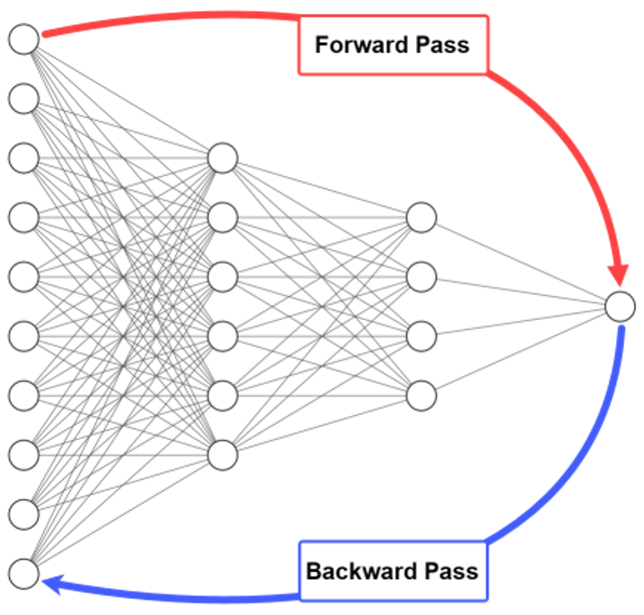

Computes the gradient of the loss with respect to every weight in the network.

Made it possible to train **units connected in series** — adding the nonlinearity
that lets a network solve **XOR**.

<!--
1 min; derived properly in week 14.
CORRECTION: the deck dates this 1975, which is Werbos's thesis. The result that
actually moved the field is Rumelhart, Hinton & Williams (1986). Both dates are
worth naming, and the 11-year gap between "published" and "noticed" is itself a
lesson about how ideas land in a field.
-->

---

# 1995 — Support Vector Machines

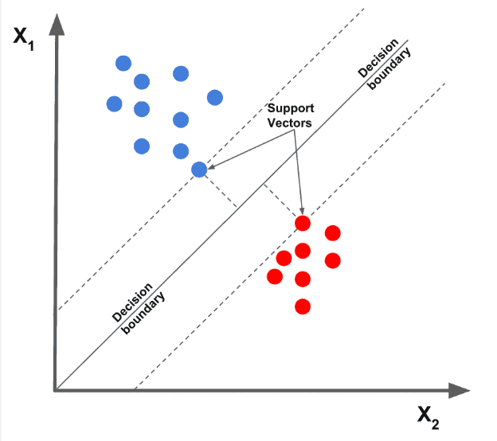

Vapnik and colleagues at AT&T Bell Labs: a linear classifier that **maximizes the
margin** between two subspaces.

Statistical learning theory arrives — generalization becomes something you can
reason about rather than hope for.

<!--
30 seconds. Milestone only. We do not teach the kernel trick in this course;
say so, and say why (it needs a session we do not have — see the coverage map).
-->

---

# 2000s — Deep learning

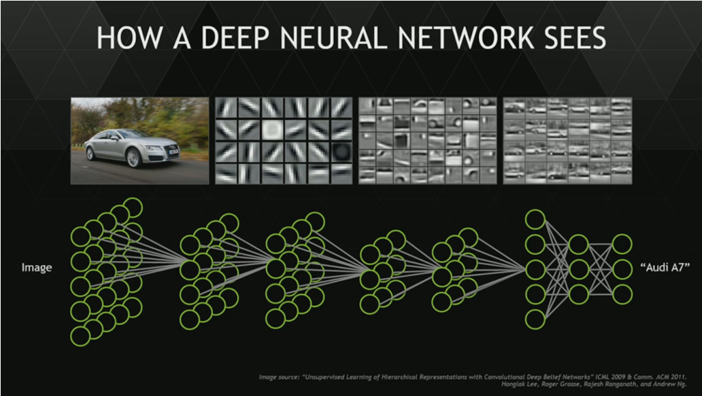

The theoretical tools existed from the 1960s; the term arrives in 1986. Bengio,
Hinton, and LeCun establish the foundations for training networks whose **depth**
can grow.

What changed was not the idea. It was **data and compute**.

---

# The limits of statistical models

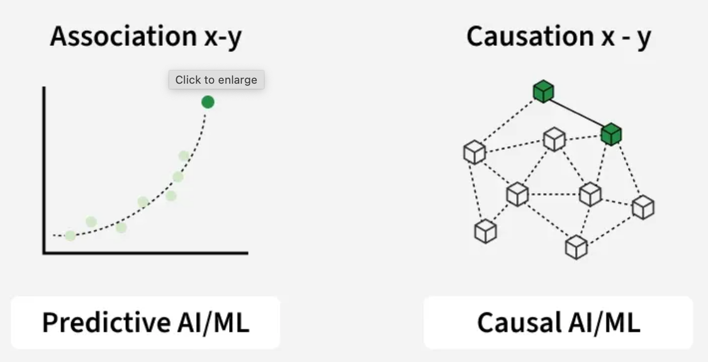

Correlation is not intervention.

**Judea Pearl's causal calculus (1987)** encodes cause-and-effect relations in a
**directed acyclic graph**, letting you ask:

- Is A the cause and B the effect?
- Is B the cause and A the effect?
- *(But not both at once.)*

A model that predicts cannot necessarily tell you **what happens if you act**.

<!--
2 min. This is the best idea in the original deck and it is easy to skip.
Keep it: it is the sharpest available statement of what a purely predictive
system does not give you — and every LLM the class benchmarks this semester is a
purely predictive system. Foreshadow week 12.
-->

---

# The timeline, in one table

| Era | Milestone | What it made *possible* |
|---|---|---|
| ~800 BC | Talos (myth) | The idea of an autonomous made thing |
| ~200 BC | Antikythera | Computation as a physical artifact |
| 1770 | Mechanical Turk | The *appearance* of intelligence — and the first AI fraud |
| 1936–45 | Z1, ENIAC | General-purpose programmable computation |
| 1950 | Turing Test | Intelligence as something you can *test for* |
| 1956 | Dartmouth | AI as a named discipline with an agenda |
| 1957–58 | FORTRAN, LISP | Imperative vs. symbolic computation |
| 1958 | Perceptron | Learning from data instead of being programmed |
| 1972 | Prolog | Computation as logical deduction |
| 1986 | Backprop (pub. 1975) | Depth → nonlinearity → XOR |
| 1987→ | Causal calculus | Reasoning about interventions |
| 1995 | SVM | Margin maximization; learning theory |
| 2000s | Deep learning | Representation learning at scale |

<!--
Do not read this aloud. It is the reference slide students screenshot.
Milestones are worth naming for what they UNLOCKED, not for their dates.
-->

---

# Next: live coding

## We build ELIZA (1966) in 40 lines

Then we break it deliberately.

**The question we will end on:**

> An LLM has no explicit model of the world either — it predicts tokens.
> Is it ELIZA with more parameters, or is it categorically different?
>
> *Write down your answer. We reopen it in week 14.*

<!--
Live-coding code is in ../../weeks/week-01.md. Collect the sealed predictions —
they are the best closing artifact available in week 14, and students lose them
if you do not hold them yourself.
-->
