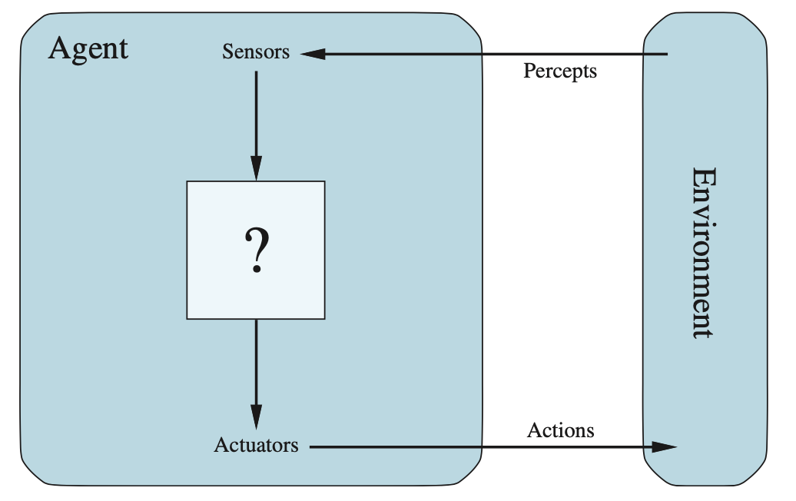
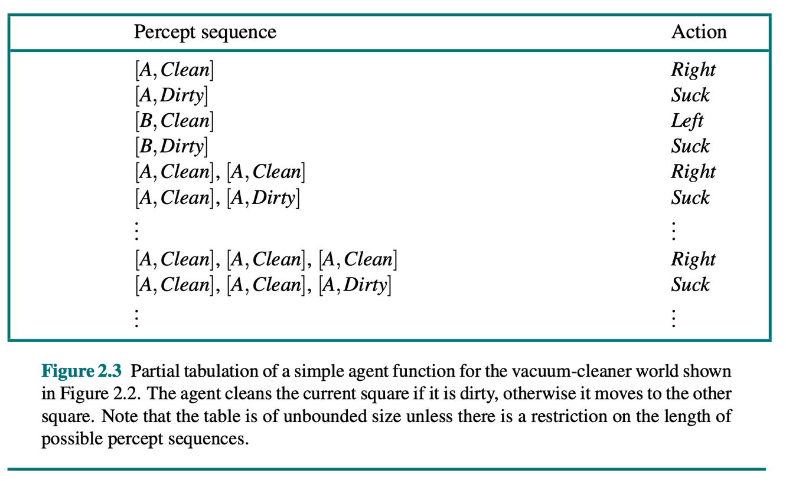
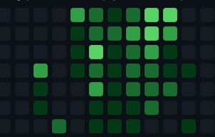
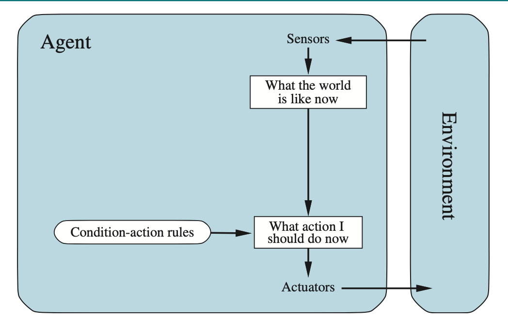
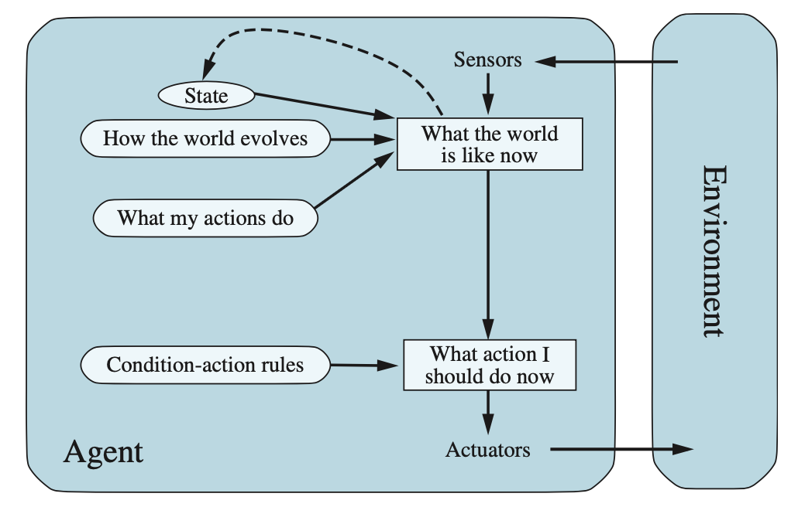
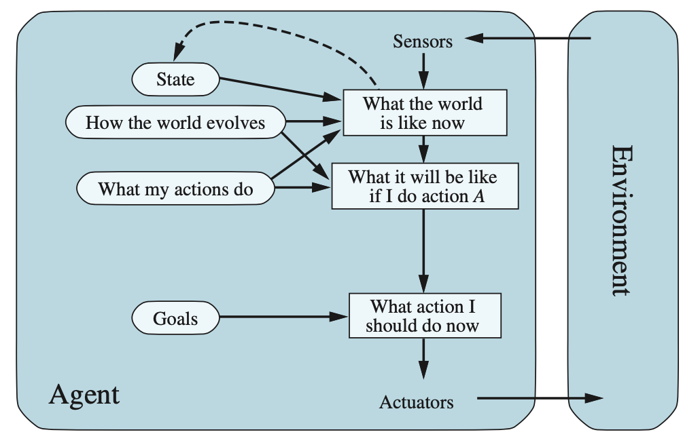
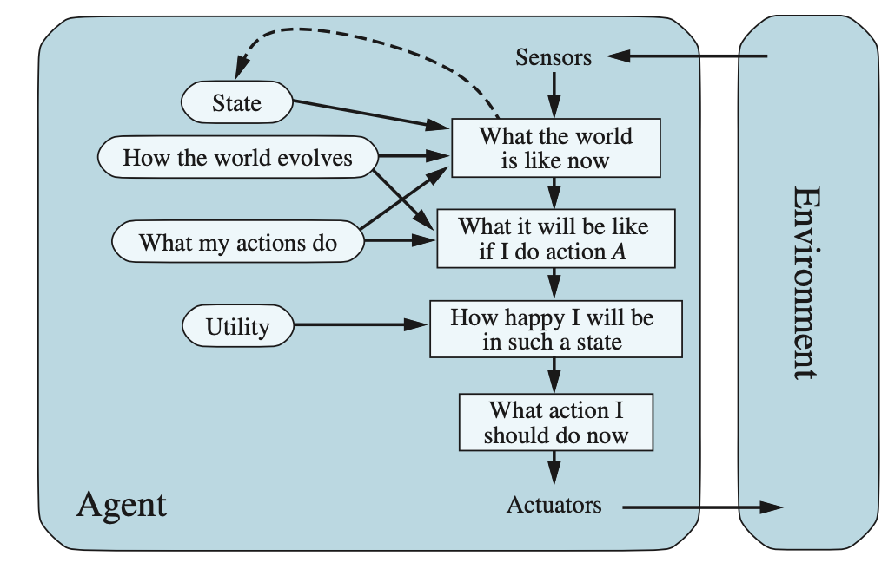
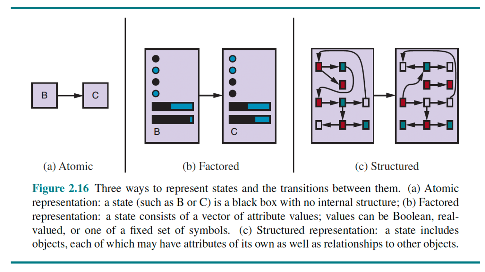

# Intelligent Agents

## The abstraction that survives everything

**CMP-4004** · Week 2

---

# What is an agent?

Anything that **perceives** its environment through sensors and **acts** on it
through actuators.

| | Sensors | → | Actuators |
|---|---|---|---|
| **Human** | eyes, ears | brain | hands, mouth |
| **Robot** | cameras, sensors | processor | motors |
| **Software agent** | keyboard, file input | program | screen, network |

That is the whole definition. It is from 1995 and it still holds — including for
anything marketed as an "AI agent" in 2026.

<!--
NOTE ON THE SOURCE DECK: slide 2 of 03_Intelligent Agents.pptx carries three
bullets about propositions and logical connectives — pasted in from the
propositional-logic deck. They do not belong on a slide titled "What Is an
Agent?" and they are replaced here. If you show the original file, skip them.
-->

---

# Agent *function* vs. agent *program*

| **Agent function** | **Agent program** |
|---|---|
| Abstract behavioral specification | Concrete implementation |
| Defines what to do in *every* possible situation | Runs on real physical architecture |
| Maps percept **history** to action: `f : P* → A` | Approximates `f` compactly and efficiently |
| In theory, a lookup table | |
| *What we want to achieve* | *How we approximate it efficiently* |

---

# Why the table is not an option

**Vacuum world.** Two rooms, A and B; each may be dirty or clean.
Sensors: current position + room status. Actuators: Left, Right, Suck.

With *T* time steps, the percept-history table has **4^T rows**.

| T | Rows |
|---|---|
| 5 | 1,024 |
| 10 | ~10⁶ |
| **20** | **~10¹²** |

> **All of AI is the search for compact programs that approximate intractable
> functions.**

<!--
5 min for this and the previous slide together. Make them compute T=20 —
do not just show the number.
That closing sentence justifies weeks 3-14. Say it exactly once, and slowly.
-->

---

# PEAS

| | |
|---|---|
| **P**erformance | The success criterion |
| **E**nvironment | The world the agent operates in |
| **A**ctuators | Mechanisms for acting on it |
| **S**ensors | Mechanisms for perceiving it |

### Automated taxi

- **P** — safe, fast, legal, comfortable, profitable *(these conflict)*
- **E** — roads, traffic, pedestrians, weather
- **A** — steering, throttle, brake, signals, horn, display
- **S** — cameras, lidar, GPS, speedometer, accelerometer

<!--
5 min. ONE example done properly, not four superficially. The payload is that
the P components conflict — which is exactly why utility-based agents exist,
four slides from now.
-->

---

# Rationality

A **rational agent** selects, at every moment, the action that maximizes the
**expected value of a performance measure**, given its percept history and
built-in knowledge.

Which may require it to:

- **Explore** the environment to gather useful information
- **Learn** from its percepts to improve future behavior

Rational ≠ omniscient. Rational ≠ correct in hindsight.

---

# The performance measure is *your* problem

The performance measure is an **external** criterion. **It is defined by the
designer, not by the agent.**

> ## ⚠️ You get what you ask for.
> ## A poor measure produces unintended behavior.

- What happens if we specify it incorrectly?
- What if we do not specify everything?

**Reward `dirt collected`** → a perfectly rational vacuum dumps dirt on the floor
so it can collect it again.

<!--
5 min, and do not rush it. This is the most important line in the source deck.
This is reward hacking / specification gaming, and it is now the central problem
in AI safety. The ethics thread of this course starts HERE, in week 2 — not in
the last lecture. Flag forward to week 14 explicitly.
-->

---

# Six environment axes — as engineering costs

| Axis | If it's the hard case, you must add… |
|---|---|
| Partially observable | belief state / state estimation **(wk 12–13)** |
| Stochastic | probabilistic reasoning, expected utility **(wk 12)** |
| Sequential | search and planning **(wk 3–9)** |
| Dynamic | real-time constraints, bounded deliberation |
| Continuous | discretization or continuous optimization **(wk 10–11)** |
| Multi-agent | adversarial reasoning **(wk 5)** |

**This table is the syllabus in disguise.** Say so out loud.

---

# The axes, stated as questions

| Axis | The question |
|---|---|
| **Observable** | Can the agent access the complete state at all times? Can its sensors detect what matters for choosing an action? Does it need memory? |
| **Deterministic** | Is the next state fully determined by the current state and the action? *Stochastic:* same input, different outputs. |
| **Episodic** | Is each percept–action episode independent? Can current decisions affect future ones? |
| **Static** | Does the environment change while the agent deliberates? *Semi-dynamic:* the world doesn't change but your score does — chess with a clock. |
| **Discrete** | A finite number of well-defined states, percepts, and actions? |
| **Single-agent** | Are other agents present — competitive or cooperative? |

   

---

# Classify these

| Task | Obs. | Det. | Epis. | Static | Disc. | Agents |
|---|---|---|---|---|---|---|
| Chess with a clock | full | det. | seq. | **semi** | disc. | multi |
| Poker | **partial** | **stoch.** | seq. | static | disc. | multi |
| Taxi driving | **partial** | **stoch.** | seq. | **dynamic** | **cont.** | multi |
| Medical diagnosis | **partial** | **stoch.** | seq. | dynamic | cont. | single |
| Crossword puzzle | full | det. | seq. | static | disc. | single |

Read the bold entries as a bill of materials. Taxi driving is bold in five
columns — which is why it is not solved.

<!--
10 min total for the three axis slides. Do the classification as a live poll or
in chat; it is much better as an activity than as a reveal.
-->

---

# Four architectures, each fixing the last one's flaw

## 1 · Simple reflex agent

- Considers only the **current percept**. No memory.
- Operates through **condition–action rules**
- ✅ Simple and efficient to implement
- ❌ **Fails in partially observable environments** — if it cannot see the
  complete state, it cannot act correctly

Works only when the current percept contains all relevant information.

---

# 2 · Model-based reflex agent

Maintains an **internal state** using two models:

- **World model** — how the environment evolves independently of the agent
- **Transition model** — how the agent's own actions affect the environment

Updates internal state each step, then applies condition–action rules **to that
state**.

Can now act coherently **without observing the complete environment**.

---

# 3 · Goal-based agent

Knowing where you *are* is not enough — you also need to know where you **want to
go**.

- **Goals** describe desired states of the world
- The agent chooses actions that move it toward the goal → this requires
  **planning and search**
- ✅ Adapts when the goal changes
- ❌ Goals are **binary**: cannot distinguish a better path from a worse one

---

# 4 · Utility-based agent

Distinguishes among solutions of **different quality**. Chooses the action that
maximizes **expected utility**, weighting outcomes by probability.

Handles:

- **Conflicting objectives** — speed vs. safety in a taxi
- **Uncertainty** — acting when the outcome is not guaranteed

Only utility lets you make a trade-off. Goals cannot.

<!--
5 min for all four. Emphasize the last step hardest — the studio task turns on
it: their utility agent will leave a room dirty because cleaning costs more than
the remaining reward, and they will report it as a bug.
-->

---

# How much structure does a state have?

| Representation | A state is… |
|---|---|
| **Atomic** | an indivisible black box, no internal structure |
| **Factored** | a set of variables/attributes with values |
| **Structured** | objects and the relationships among them |

**Why does the level matter?**

Greater expressiveness enables more reasoning — and increases computational
complexity.

*Atomic → weeks 3–5. Factored → week 6. Structured → weeks 8–9.*

---

# Next: live coding

## Vacuum world, three agents, one interface

Then we **break the location sensor** in four lines and watch the reflex agent
become unable to act.

**Studio:** you will plug an LLM into the same `percept → action` socket and
count how many lines of defensive code it needs that the classical agents did not.

<!--
Code is in ../../weeks/week-02.md. The sensor break is the beat that earns the
model-based agent; do not skip straight to the fix.
-->
